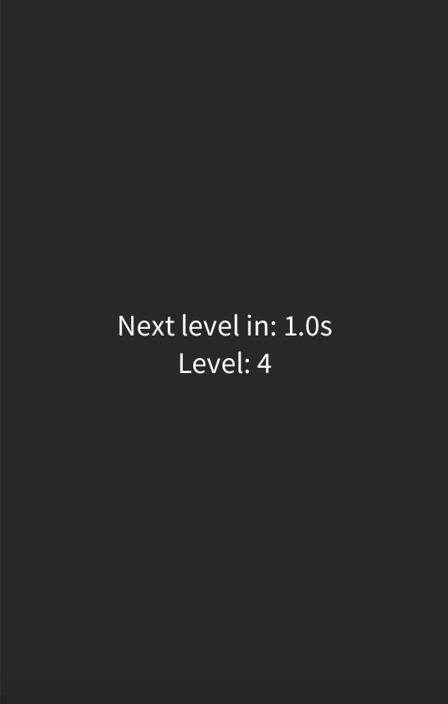

# Programming 1 Portfolio | Jamie Duersch | jamieduersch@icloud.com | 10/14/2025

# Certifications: Computer Programming 1 State Certification

## Projects for Term 1

### Calculator (October-November 2025)

This is a modern, dark-themed desktop calculator with a clean interface and rounded white buttons. It includes standard arithmetic operations, advanced functions such as square root, exponentiation (^), pi (π), and rounding (rnd), along with utilities like negative/positive (+/-), delete (del), and clear (C). The large equals button and responsive display make calculations quick and intuitive. Styled like a macOS app, it features familiar window controls and a compact, user-friendly layout—perfect for both basic and advanced math tasks.

*  [Windows EXE](https://github.com/9711519-png/jamie-s-portfolio/blob/main/src/Calculator/windows-amd64.zip)
*  [Mac OS](https://github.com/9711519-png/jamie-s-portfolio/blob/main/src/Calculator/macos-aarch64.zip)
*  [Source Code](src/Calculator/)
*   [CalculatorUML](https://github.com/9711519-png/jamie-s-portfolio/blob/main/images/CalculatorUML2.jpg?raw=true)

### Ball Bounce (November)

* [Source Code](src/BallBounce/)
## Projects for Term 2

### Skifree (November-December 2025)

SkiFree is a classic Windows game released by Microsoft in 1991, where players guide a skier downhill while avoiding trees, rocks, and other obstacles. The skier moves automatically, making quick steering decisions essential as the speed increases. The game is especially remembered for its surprise ending, in which a yeti appears to chase and eventually catch the skier, giving the otherwise simple game an iconic twist.

* [Windows EXE](https://github.com/9711519-png/jamie-s-portfolio/blob/main/src/Skifree/windows-amd64.zip)
* [Mac OS](https://github.com/9711519-png/jamie-s-portfolio/blob/main/src/Skifree/macos-aarch64.zip)
* [Group Repository](https://github.com/pwspew/compProcessing-project-skifree)
* [Source Code](https://github.com/pwspew/compProcessing-project-skifree.git)

### Level Management

This Processing sketch displays a simple level counter with a countdown timer. The program starts at level 1 and decreases the timeLeft value every frame to simulate seconds passing. When the timer reaches zero, the level increases by one and the timer resets to three seconds. Each frame, the screen is cleared and updated text shows the current level and how many seconds remain until the next level, creating a looping level-up countdown effect.

*[Source Code](https://github.com/9711519-png/jamie-s-portfolio/blob/main/src/LevelManagement/Level_Management/Level_Management.pde)

### Collision Example

This Processing program creates a simple top-down movement game where the player controls a blue circle using the WASD keys. The player can move around the window but is constrained to stay within the screen and cannot pass through red circular barriers placed around the play area. Each frame, the player’s previous position is saved so that if a collision with a barrier is detected, the movement is undone, creating a solid collision effect. The sketch demonstrates object-oriented programming, keyboard input, collision detection using distance, and basic collision resolution.

!Running [CollisonExample](images/CollisionExample.png)

*[Source Code](https://github.com/9711519-png/jamie-s-portfolio/tree/main/src/CollisionExample/CollisionExample)
