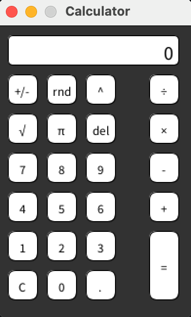
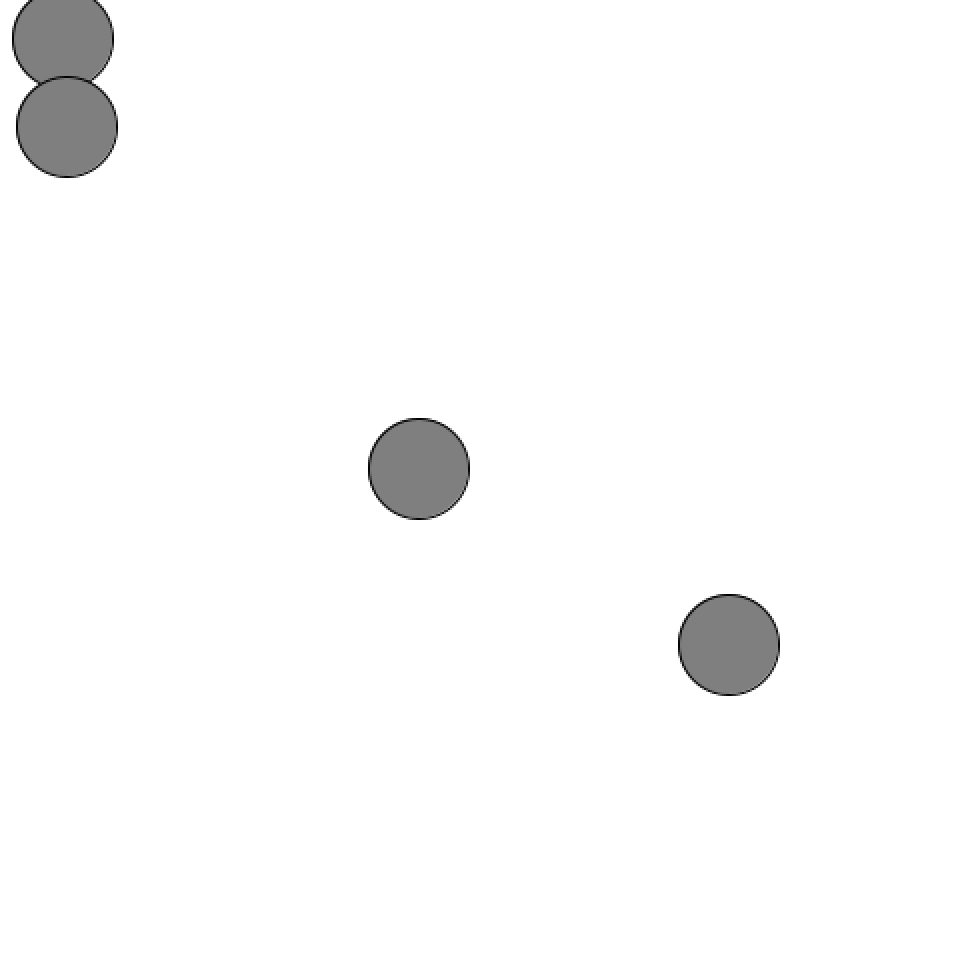
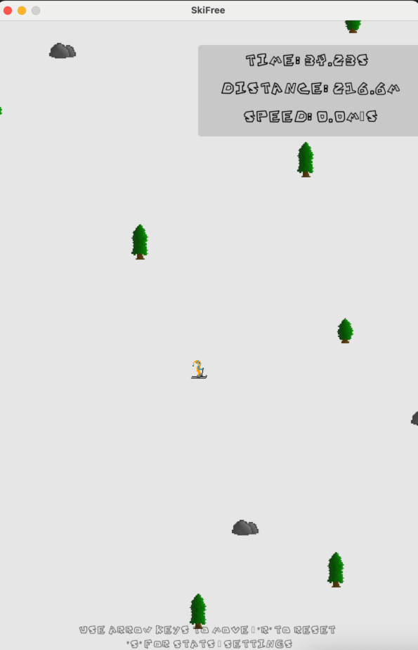

# Programming 1 Portfolio | Jamie Duersch | jamieduersch@icloud.com | 10/14/2025

# Certifications: Computer Programming 1 State Certification

## Projects for Term 1

### Calculator (October-November 2025)

This is a modern, dark-themed desktop calculator with a clean interface and rounded white buttons. It includes standard arithmetic operations, advanced functions such as square root, exponentiation (^), pi (π), and rounding (rnd), along with utilities like negative/positive (+/-), delete (del), and clear (C). The large equals button and responsive display make calculations quick and intuitive. Styled like a macOS app, it features familiar window controls and a compact, user-friendly layout—perfect for both basic and advanced math tasks.

*  [Windows EXE](https://github.com/9711519-png/jamie-s-portfolio/blob/main/src/Calculator/windows-amd64.zip)
*  [Mac OS](https://github.com/9711519-png/jamie-s-portfolio/blob/main/src/Calculator/macos-aarch64.zip)
*  [Source Code](src/Calculator/)
*   [CalculatorUML](https://github.com/9711519-png/jamie-s-portfolio/blob/main/images/CalculatorUML2.jpg?raw=true)

### Ball Bounce (November)

* [Source Code](src/BallBounce/)
## Projects for Term 2

### Skifree (November-December 2025)

SkiFree is a classic Windows game released by Microsoft in 1991, where players guide a skier downhill while avoiding trees, rocks, and other obstacles. The skier moves automatically, making quick steering decisions essential as the speed increases. The game is especially remembered for its surprise ending, in which a yeti appears to chase and eventually catch the skier, giving the otherwise simple game an iconic twist.

* [Windows EXE](https://github.com/9711519-png/jamie-s-portfolio/blob/main/src/Skifree/windows-amd64.zip)
* [Mac OS](https://github.com/9711519-png/jamie-s-portfolio/blob/main/src/Skifree/macos-aarch64.zip)
* [Group Repository](https://github.com/pwspew/compProcessing-project-skifree)
* [Source Code](https://github.com/pwspew/compProcessing-project-skifree.git)

